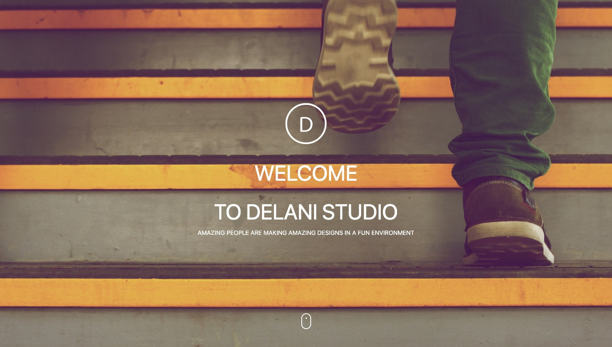

# delani-studio

## Project Description
A model landing page for a fictional brand 'Delani Studio'  implemented with Bootstap for mobile first approach and Jquery for customized animation effects.

## Installation and Set-up
Here is a run through of how to set up the application
* Step 1 : Clone this repository using **`git clone https://github.com/jumaBrian/delani-studio.git**, or downloading a ZIP file of the code.
* Step 2 : The repository, if downloaded as a .zip file will need to be extracted o your preferred location and opened
* Step 3 : Open the index.html file to view the application on your preferred web browser
## Other Usage / Live link
* Get access to the Internet/Browser.
* Click on live link provided : https://jumabrian.github.io/delani-studio/
## Built With
* HTML5.
* CSS3.
* BOOTSTRAP 5.
* JQuery.

## Author
jumaBrian 

 
Contact me via Email: njengabrianj@gmail.com

## License 
The project is served under the MIT LICENSE copyright &copy; 2022 jumaBrian.
View <a href="https://https://github.com/jumaBrian/delani-studio/blob/main/LICENSE">license</a>
